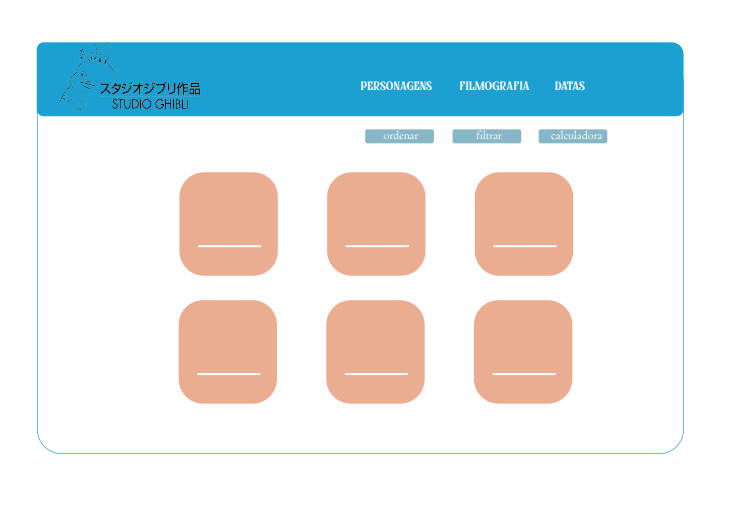
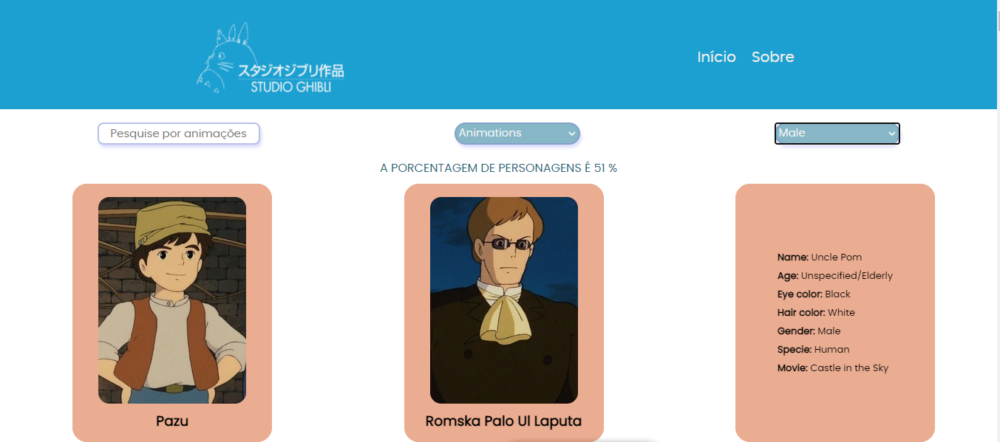

# Data Lovers - Studio Ghibli

## Índice

Aplicação web que permite ao usuário visualizar dados e informações descritivas, podendo ordena-los, filtra-los e obter um determinado cálculo agregado. Produzido por Isis Ribeiro e Mayara Bezerra, no segundo projeto do _bootcamp_ da **Laboratória**.

- [1. Sobre o projeto](#1-sobre-o-projeto)
- [2. Histórias de Usuários](#2-histórias-de-usuários)
- [3. Interface](#3-interface)
- [4. Testes de usabilidade](#4-testes-de-usabilidade)
- [5. Conteúdo de Aprendizagem](#5-conteúdo-de-aprendizagem) 

---

## 1. Sobre o projeto

O tema escolhido para o projeto foi o Studio Ghibli, pela simpatia com as animações e personagens. 
Studio Ghibli é um estúdio japonês de animação, muito conhecido por seus filmes como **Meu Amigo Totoro, A Viagem de Chihiro, O Castelo Animado**, entre outros grandes sucessos. As animações são bem recebidas em todo o mundo e algumas receberam várias nomeações e prêmios. De todo esse fandom há um grupo que deseja interagir e ver as informações das animações e seus personagens.

Desenvolvido a partir de um data set que possui informações relevantes sobre as animações, como pontuações, diretores, produtores, resumos, bem como personagens e características de cada um deles, nossa interface possibilita ao usuário visualizar todos esses dados de maneira simples e prática.

Histórias de usuários foram planejadas de acordo com essa [pesquisa](https://github.com/isisnoron/SAP006-data-lovers/blob/main/src/data/ghibli/README.md), e os testes de usabilidade com fãs do Studio Ghibli. Ademais, o layout foi planejado de forma que facilitasse o acesso do usuário, com cores que remetem ao Studio Ghibli.

## 2. Histórias de Usuários

Ao analisar a [pesquisa](https://github.com/isisnoron/SAP006-data-lovers/blob/main/src/data/ghibli/README.md), os usuários foram divididos em dois setores.

A primeira história é sobre o usuário que possui pouco conhecimento das animações do Studio Ghibli, e precisa de um site que facilite o acesso a elas. As informações relevantes de que necessita são: foto da animação, título, resumo, ano de lançamento, produtor e diretor.

Definição de pronto: o usuário precisa ver todas as animações na tela inicial através de _cards_, encontrar as informações relevantes junto das animações, ter acesso a todos os personagens, suas características, e em qual animação aparecem.

A segunda história é sobre o usuário que deseja ordenar as animações de A-Z e Z-A, ver na tela todos os personagens, filtra-los de acordo com o gênero feminino e masculino, e saber a porcentagem de cada.

Definição de pronto: o usuário precisa escolher como quer ordenar as animações (A-Z ou Z-A) através de um _select_, bem como poder filtrar os personagens a partir de um _select_, podendo escolher entre feminino, masculino e outros personagens, já obtendo um cálculo da porcentagem que cada opção representa em relação a todas as animações. 

## 3. Interface

No início do projeto desenhamos um protótipo de alta fidelidade, decidindo como seria o layout, a paleta de cores, _cards_ e as opções de botões. Seguimos com a mesma ideia do protótipo até o final do projeto, deixando-a responsiva para celular, tablets e notebooks. 
 

A barra inicial contém a logo do Studio Ghibli. Nela, fizemos alteração da cor preta para a branca. Também temos as opções “Início” e “Sobre”.

As animações aparecem na página inicial, divididas por _cards_ de 2 faces. No desktop, ao passar o mouse por cima do _card_, ele rotaciona. O mesmo acontece ao usuário que utiliza o site pelo celular, ao clicar em cima do card.

A parte da frente do _card_ mostra a imagem da animação, título e ano de lançamento. Na parte de trás, aparecem as informações de pontuação, diretor, produtor e descrição da animação.

A definição da paleta de cores foi baseada na animação _“Spirited Away”_ , com cores agradáveis e leves, remetendo ao Studio Ghibli. As cores mais utilizadas na página de início foram azul e rosa. As demais foram utilizadas na página “Sobre”.

## Projeto Final

**Home**
 

   
   
**Página dos personagens** 

_Com filtro para personagens masculinos e cálculo agregado_
 

## 4. Testes de usabilidade

Durante o teste de usabilidade, na página inicial o usuário clicou no _card_ de animação, esperando que o mesmo aumentasse, ou que fosse direcionado para outra tela para ver informações sobre as animações. Isso foi sanado com a rotação do _card_, pois ao passar o mouse por cima do mesmo, ele rotaciona mostrando a parte de trás, onde contém as informações das animações.

O usuário clicou no botão “Sobre” e desceu a página para ler todas as informações. Porém, para voltar ao início, o usuário clicou na logo do Studio Ghibli. Colocamos na barra inicial o botão de “Início” para sanar o problema. 

Além disso, na página dos personagens, o usuário disse ter interesse em saber qual em qual animação cada personagem aparece. Desta forma, acrescentamos na parte de trás dos _cards_ o nome do filme que cada personagem aparece.

## 5. Conteúdo de Aprendizagem

O objetivo principal desse projeto é aprender a desenhar e construir uma interface web, onde se possa visualizar e manipular dados, entendendo o que o usuário necessita.

Dessa forma, utilizamos:

### HTML e CSS

- [ ] [Uso de HTML semântico.](https://developer.mozilla.org/en-US/docs/Glossary/Semantics#Semantics_in_HTML)
- [ ] Uso de seletores de CSS.
- [ ] Construir sua aplicação respeitando o desenho realizado (protótipo).
- [ ] [Uso de flexbox em CSS.](https://css-tricks.com/snippets/css/a-guide-to-flexbox/)

### DOM e Web APIs

- [ ] Uso de seletores de DOM.
- [ ] Gerenciamento de eventos de DOM.
- [ ] [Manipulação dinâmica de DOM.](https://developer.mozilla.org/pt-BR/docs/DOM/Referencia_do_DOM/Introdu%C3%A7%C3%A3o) (appendChild |createElement | createTextNode| innerHTML | textContent | etc.)

### JavaScript

- [ ] Uso de condicionais (if-else | switch | operador ternário)
- [ ] Uso de laços (for | for..in | for..of | while)
- [ ] Uso de funções (parâmetros | argumentos | valor de retorno)
- [ ] Manipular arrays (filter | map | sort | reduce)
- [ ] Manipular objects (key | value)
- [ ] Uso ES modules ([`import`](https://developer.mozilla.org/en-US/docs/Web/JavaScript/Reference/Statements/import) | [`export`](https://developer.mozilla.org/en-US/docs/Web/JavaScript/Reference/Statements/export))
- [ ] Diferenciar entre expression e statements.
- [ ] Diferenciar entre tipos de dados atômicos e estruturados.

### Testing

- [ ] [Teste unitário.](https://jestjs.io/docs/pt-BR/getting-started)

### Estrutura do código e guia de estilo

- [ ] Organizar e dividir o código em módulos (Modularização)
- [ ] Uso de identificadores descritivos (Nomenclatura | Semântica)
- [ ] Uso de linter (ESLINT)

### Git e GitHub

- [ ] Uso de comandos de git (add | commit | pull | status | push)
- [ ] Gerenciar repositórios de GitHub (clone | fork | gh-pages)
- [ ] Colaboração no Github (branches | pull requests | |tags)
